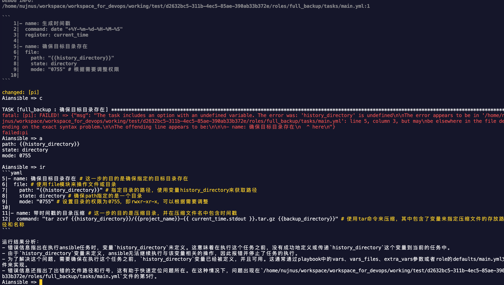
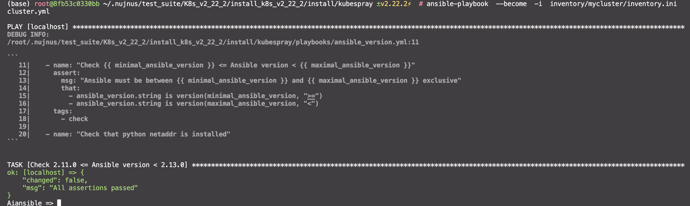

# aiansible:
[切换到中文](./README.md)

  调试ansible, 并通过chatgpt or kimi注释和提示错误的解决办法.

  Debug Ansible, and use chatgpt or kimi AI annotations and hints to resolve errors.
  
  - "It may be the first non-embedded Ansible debugger on the market."
  - "It should be the first Ansible debugger on the market with AI hinting features."
  - "It may be the second Ansible debugger on the market that truly provides breakpoint debugging capabilities."


## 基本使用说明/basic usage:
```
i              Comment on the current task's code being executed
ir             In the same line after each line of code, comment on the following code, analyze the reason for the execution result, and then tell me how to improve
ask            Please answer questions based on the current Ansible task
n    next      Run the next task
m              Do not stay at the same task immediately after this one
c    continue  Continue running until the next breakpoint
b              Create a breakpoint
p              View existing breakpoints
d    delete    Delete a breakpoint
bt             View the tasks that have already been executed
code           View the currently running task
v              Open the corresponding file with Visual Studio Code
a    arg       View all arguments, or a single argument (provided the task has not been skipped)
?    help      View the usage instructions
exit           Exit
```

## ai提示效果/ai prompt example:


### install and start using aiansible:
- (1) **download and install**
```
  git clone https://github.com/sunnycloudy/aiansible.git
  cd aiansible
  pip install .  #=> will generate dir: ~/.aiansible_plugin
```


- (2) **install dependents:**
```
pip install  -r requirements.txt
```

- (3) **create a:debug.cfg**
```
[defaults]
callback_plugins = ~/.aiansible_plugin
callbacks_enabled = aiansible.py
```
- (4) **set environments:**
```
export OPENAI_API_URL=https://api.moonshot.cn/v1  #或者其他兼容openai的api地址
export OPENAI_API_KEY=xxxxxxxxxxxxxxxxxxxxxxxxxxxxx #或者其他兼容openai的key
export ANSIBLE_CONFIG=./debug.cfg
```
- (5) **run command:**
```
ansible-playbook  xxx_playbook.yml
```


## kubespray example:
```
# find
kubespray/ansible.cfg
```

### edit kubespray default ansible.cfg:
```
[ssh_connection]
pipelining=True
ansible_ssh_args = -o ControlMaster=auto -o ControlPersist=30m -o ConnectionAttempts=100 -o UserKnownHostsFile=/dev/null
#control_path = ~/.ssh/ansible-%%r@%%h:%%p
[defaults]
# https://github.com/ansible/ansible/issues/56930 (to ignore group names with - and .)
force_valid_group_names = ignore

host_key_checking=False
gathering = smart
fact_caching = jsonfile
fact_caching_connection = /tmp
fact_caching_timeout = 86400
stdout_callback = default
display_skipped_hosts = no
library = ./library
# callbacks_enabled = profile_tasks,ara_default      #<= comment it   (･ω･)ﾉ
callback_plugins = ~/.aiansible_plugin               #<=  new line (｡･ω･｡)ﾉ
callbacks_enabled = aiansible.py                     #<=  new line ( ・ω・ )ノ

roles_path = roles:$VIRTUAL_ENV/usr/local/share/kubespray/roles:$VIRTUAL_ENV/usr/local/share/ansible/roles:/usr/share/kubespray/roles
deprecation_warnings=False
inventory_ignore_extensions = ~, .orig, .bak, .ini, .cfg, .retry, .pyc, .pyo, .creds, .gpg
[inventory]
ignore_patterns = artifacts, credentials

```

### run command:
```
export OPENAI_API_URL=https://api.moonshot.cn/v1  #或者其他兼容openai的api地址
export OPENAI_API_KEY=xxxxxxxxxxxxxxxxxxxxxxxxxxxxx #或者其他兼容openai的key
export ANSIBLE_CONFIG=./ansible.cfg
ansible-playbook  --become  -i  inventory/mycluster/inventory.ini  cluster.yml
```


