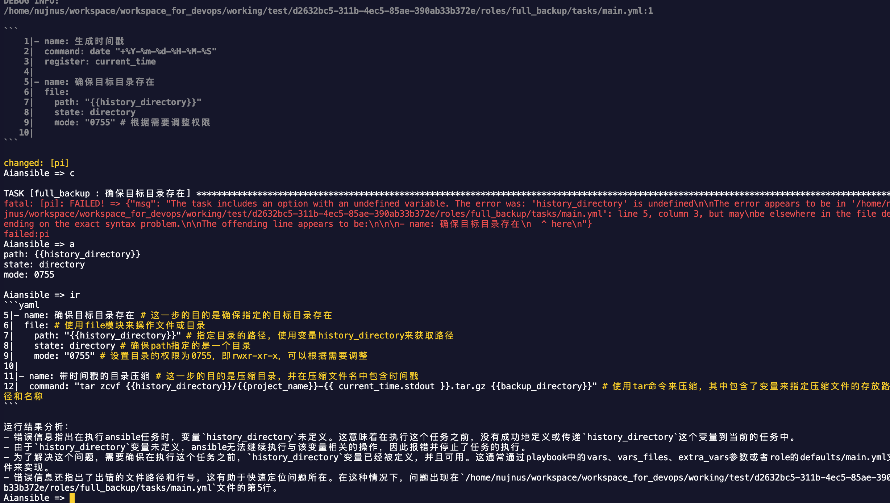

# aiansible:
[Link to ENGLISH README](./ENGLISH_README.md)


  调试ansible, 并通过chatgpt or kimi注释和提示错误的解决办法.

  Debug Ansible, and use chatgpt or kimi AI annotations and hints to resolve errors.
  
   - 可能是市面上第一款非嵌入式的ansible调试器
   - 应该是市面上第一款带ai提示功能的ansible调试器
   - 可能是市面上第二款真正意义上可以提供断点调试功能的ansible调试器


## 基本使用说明/basic usage:
```
i              对当前执行的任务代码进行注释
ir             在每行代码后的同一行内, 注释一下如下代码, 再分析一下运行结果的原因, 再告诉我该如何改进
ask            请根据当前ansible任务:回答问题
n    next      运行下一个任务
m              不再在紧接着的同一个任务处停留
c    continue  继续运行直到下一个断点
b              创建断点
p              查看已经创建的断点
d    delete    删除断点
bt             查看已经运行过哪些任务了
code           查看正在运行的任务
v              用vscode打开对应文件
a    arg       查看所有参数, 或单个参数 (在任务没有被skipped的前提下)
?    help      查看使用说明
exit           退出
```

## 使用效果/example:


### 安装/install:
- (1) **下载当前目录到任意路径, 比如: /home/nujnus/workspace/aiansible**

- (2) **安装依赖:**
```
pip install  -r requirements.txt
```

- (3) **创建一个:debug.cfg**
```
[defaults]
callback_plugins = /home/nujnus/workspace/aiansible
callbacks_enabled = aiansible.py
```
- (4) **设置环境变量:**
```
export OPENAI_API_URL=https://api.moonshot.cn/v1  #或者其他兼容openai的api地址
export OPENAI_API_KEY=xxxxxxxxxxxxxxxxxxxxxxxxxxxxx #或者其他兼容openai的key
export ANSIBLE_CONFIG=./debug.cfg
```
- (5) **运行命令/run command:**
```
ansible-playbook  xxx_playbook.yml
```


## 以调试kubespray未例:
```
# 先找到
kubespray/ansible.cfg
```

### 看到配置:
```
[ssh_connection]
pipelining=True
ansible_ssh_args = -o ControlMaster=auto -o ControlPersist=30m -o ConnectionAttempts=100 -o UserKnownHostsFile=/dev/null
#control_path = ~/.ssh/ansible-%%r@%%h:%%p
[defaults]
# https://github.com/ansible/ansible/issues/56930 (to ignore group names with - and .)
force_valid_group_names = ignore

host_key_checking=False
gathering = smart
fact_caching = jsonfile
fact_caching_connection = /tmp
fact_caching_timeout = 86400
stdout_callback = default
display_skipped_hosts = no
library = ./library
# callbacks_enabled = profile_tasks,ara_default      #<= 注释掉   (･ω･)ﾉ
callback_plugins = /home/nujnus/workspace/aiansible  #<=  新添加的 (｡･ω･｡)ﾉ
callbacks_enabled = aiansible.py                     #<=  新添加的 ( ・ω・ )ノ

roles_path = roles:$VIRTUAL_ENV/usr/local/share/kubespray/roles:$VIRTUAL_ENV/usr/local/share/ansible/roles:/usr/share/kubespray/roles
deprecation_warnings=False
inventory_ignore_extensions = ~, .orig, .bak, .ini, .cfg, .retry, .pyc, .pyo, .creds, .gpg
[inventory]
ignore_patterns = artifacts, credentials

```

### 运行命令/run command:
```
export OPENAI_API_URL=https://api.moonshot.cn/v1  #或者其他兼容openai的api地址
export OPENAI_API_KEY=xxxxxxxxxxxxxxxxxxxxxxxxxxxxx #或者其他兼容openai的key
export ANSIBLE_CONFIG=./debug.cfg
ansible-playbook  --become  -i  inventory/mycluster/inventory.ini  cluster.yml
```


